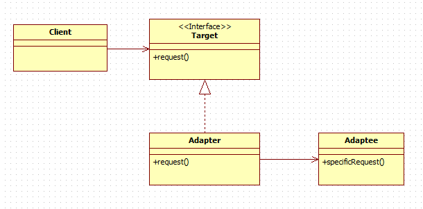
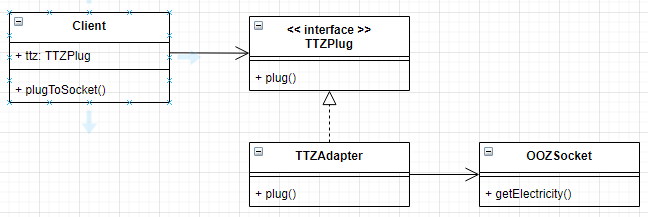

# 어댑터 패턴이란?

어느 객체의 인터페이스를 클라이언트가 사용하고자 하는 다른 인터페이스로 교체하는 패턴

콘센트를 예시로 들면, 한국 표준 전기 플러그를 일본의 전원 소켓에 바로 끼울 수 없으니, 110v 어댑터를 플러그에 끼운 뒤에 사용해야 한다.

어댑터 패턴을 클래스 다이어그램으로 표현하면 아래와 같다.



클래스 다이어그램과 콘센트 예시를 대응시켜보자면, Target은 220v 플러그, Adapter는 220To110 어댑터, Adaptee는 110v 소켓이라고 할 수 있다. 즉, 사용자가 궁극적으로 사용하고자 하는 건 Adaptee이고, 이를 위해 인터페이스를 변환해주는 요소가 Target 인터페이스와 Adapter 클래스이다.
<br/><br/>

# 어댑터 패턴 예시

조금 더 이해하기 쉽도록 위에서 든 콘센트 예시를 클래스 다이어그램과 코드로 나타내보자.



```java
// Client.java
public class Client {
    private TTZPlug ttzPlug;

    Client() {
        ttzPlug = new TTZAdapter();
    }

    public void plugToSocket() {
        ttzPlug.plug();
    }
}
```

Client에서 플러그를 꽂는 plugToSocket() 동작을 할 수 있다.

Client는 현재 220v 플러그 (ttzPlug) 를 갖고 있다.

ttzPlug에 TTZAdapter 인스턴스를 할당하는 동작이 220v 플러그에 110v 어댑터를 장착하는 행위이다.

```java
// TTZPlug.java
public interface TTZPlug {
    abstract void plug();
}

// TTZAdapter.java
public class TTZAdapter implements TTZPlug {
    private OOZSocket oozSocket;

    TTZAdapter() {
        oozSocket = new OOZSocket();
    }

    public void plug() {
        oozSocket.getElectricity();
    }
}

// OOZSocket.java
public class OOZSocket {
    private int electricity = 110;

    public void getElectricity() {
        System.out.println("110v 소켓에 플러그를 꽂았습니다!");
        System.out.println("현재 전류는 " + electricity + " 입니다. ");
    }
}

// Main.java
public class Main {
    public static void main(String[] args) {
        Client client = new Client();
        client.plugToSocket();
    }
}
```

main함수에서 겉으로 보기에 client는 단순히 소켓에 플러그를 꽂는 동작을 한다.

client.plugToSocket()이 호출되면 client의 ttzPlug.plug() 가 호출되는데, ttzPlug는 TTZAdapter 인스턴스의 참조 변수이므로 TTZAdapter의 plug()가 호출된다.

TTZAdapter의 plug()에서는 OOZSocket의 getElectricity()를 호출하는 **동작 변환 작업**을 해준다.

즉, client가 소켓에 플러그를 꽂으면 Client.plugToSocket() → TTZAdapter.plug() → OOZ.getElectricity() 와 같이 동작의 변환이 발생한다.

만약 100v 소켓에  220v 플러그를 끼워야 한다면? 단순히 그에 맞게 동작을 변환해주는 클래스 (위 예시에선 TTZPlug를 implements하는 클래스) 를 만들어주면 된다!
<br/><br/>

# 어댑터 패턴, 어디서 쓰이나?

대표적인 예시가 자바의 Enumeration과 Iterator 간의 호환성을 위해 사용되는 예시이다.

Enumeration과 Iterator는 모두 자바 컬렉션에서 데이터를 조회하는 방법과 관련된 통합 인터페이스를 제공한다. 다만 Enumeration은 Iterator와 다르게 remove() 메서드를 지원하지 않는다.

만약 Enumeration을 지원하는 컬렉션과 Iterator를 지원하는 컬렉션을 함께 관리해야 한다면? Enumeration을 Iterator처럼 사용할 수 있게 하는 어댑터를 만들면 된다!

```java
public class EnumerationIterator implements Iterator {
    Enumeration enumeration;

    public EnumerationIterator(Enumeration enumeration) {
             this.enumeration= enumeration;
    }

    @Override
    public boolean hasNext(){ 
       return enumeration.hasMoreElements();
    }

    @Override
    public Object next() {
       return enumeration.nextElement();
    }

    @Override
    public void remove() {
       throw new UnsupportedOperationException(); //예외 던짐 UnsupportedOperationException 지원
    }
}

출처: https://jusungpark.tistory.com/22 [정리정리정리]
```

이 경우 Target은 Iterator, Adapter는 EnumerationIterator, Adaptee는 Iterator라고 볼 수 있다.