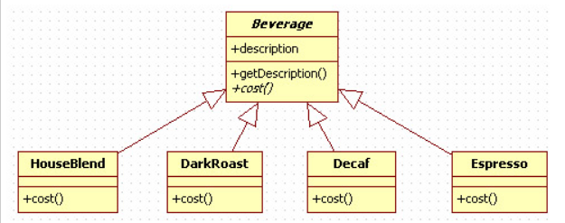
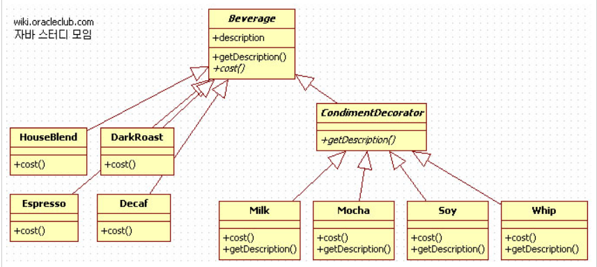

# 데코레이터 패턴이란?

데코레이터 패턴은 주어진 상황 및 용도에 따라 어떠한 객체에 책임을 덧붙이는 패턴이다.

어느 객체에 기능 확장이 필요할 때 보통 그 클래스를 상속받는 서브클래스를 만드는 방법을 생각하지만, 확장할 기능이 다양할수록 서브클래스를 만드는 방법은 비효율적이다. 데코레이터 패턴은 객체에 런타임 시 동적으로, 유연하게 기능을 추가해야할 때 적합한 디자인 패턴이다.
<br/><br/>

# 데코레이터 패턴 예시

Head First Design Patterns 책에서는 커피와 각 커피에 들어가는 재료를 예시로 들고 있다. 커피 종류 클래스를 아래와 같이 구성했다고 가정하자.



보통 커피를 주문할 때 모카, 우유 등의 재료를 추가할 수 있다. 이 개념을 데코레이터 패턴 없이 적용하려면 어떻게 설계할 수 있을까?

- DarkRoast 커피에 모카를 추가하면 DarkRoatWithMocha 서브 클래스가 존재해야 한다.
- DarkRoast 커피에 우유를 추가하면 DarkRoatWithMilk 서브 클래스가 존재해야 한다.
- DarkRoast 커피에 모카,우유를 추가하면 DarkRoatWithMochaMilk 서브 클래스가 존재해야 한다.
- 기타 등등..

커피에 추가할 수 있는 재료가 많아질수록, 그 재료 간 조합이 다양해질수록 생성해야하는 서브 클래스의 수가 기하급수적으로 증가한다. 이러한 설계는 후에 재료를 추가하거나 삭제하는 상황이 발생하면 코드의 유지보수성, 확장성, 재사용성을 저하시킨다.

이 설계에 데코레이터 패턴을 적용하면 어떻게 바뀔까?



데코레이터 패턴에서는 각각의 재료를 음료를 조상 클래스로 하는 서브 클래스로 표현한다. 어떤 음료에 재료를 추가하는 행위를 코드로 나타낼 때 재료 객체로 음료를 감싸는 형태로 표현한다.

아래는 위 설계대로 코드를 구현한 예시 코드이다.

```java
/*
	예시 코드
	출처 : http://wiki.gurubee.net/pages/viewpage.action?pageId=1507398
*/

// Beverage.java
public abstract class Beverage {
	
  protected String description = "제목없음";
		
  public abstract double cost();
    public String getDescription() {
      return description;

    }
}

// Espresso.java
public class Espresso extends Beverage {
	
  public Espresso(){
    //Beverage로부터 상속받음
    description = "에스프레소 커피";	
  }
	
  @Override
  public double cost() {
    return 1.99;
  }
}

// Mocha.java
public class Mocha extends CondimentDecorator {

  //감싸고자 하는 음료(하우스블렌드,다크로스트,디카페인,에스프레소)를 저장하는 인스턴스.
  Beverage beverage;
	
  //생성자를 이용해서 감싸고자 하는 음료 객체를 전달한다.
  public Mocha(Beverage beverage){
    this.beverage = beverage;
  }
	
  @Override
  public String getDescription() {
    //음료 명에 첨가물명을 추가한다.
    return beverage.getDescription() + ", 모카";
  }

  //CondimentDecorator는 Beverage를 확장 하죠
  @Override
  public double cost() {
    //음료 가격에 모카 가격을 추가한다.
    return .20 + beverage.cost();
  }
}
```

이 코드로 에스프레소 음료에 모카를 어떻게 추가하는지 살펴보자.

- Beverage 참조 변수인 espresso를 선언한다.

    `Beverage espresso = new Espresso()`

- 모카를 추가하고 싶다면, 모카 객체로 espress 객체를 감싼다.

    `espress = new Mocha(espresso)`

- 이 상태에서 espresso의 가격은 espresso.cost()로 구할 수 있다.

    espresso.cost()를 호출하면, 모카 객체 내의 cost() 메서드가 호출된다. 모카 객체의 cost() 메서드 내에서 beverage.cost()를 호출해서 순수 espresso의 갸격을 반환받고, 여기에 모카 추가값을 더해 반환해주므로 모카가 추가된 espresso 가격을 얻을 수 있다.

이처럼 데코레이터 패턴을 이용하면 음료와 데코레이터(재료) 간 다형성을 이용해 유연하게 객체의 기능 확장을 이끌어낼 수 있다.