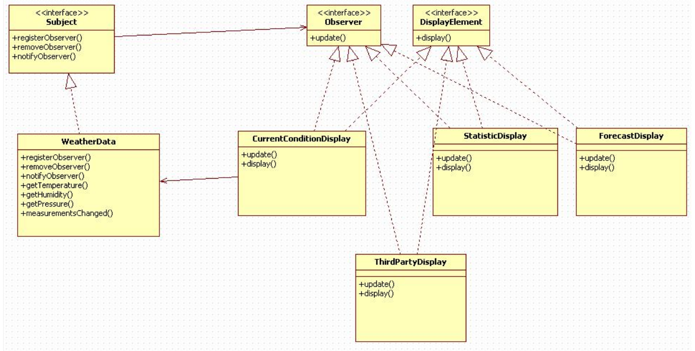
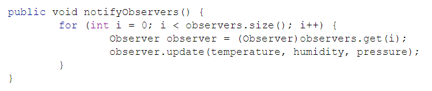
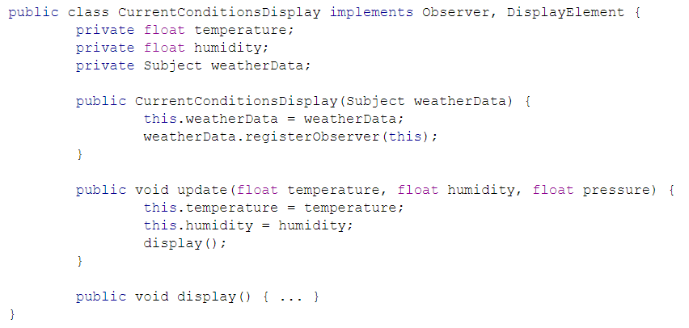
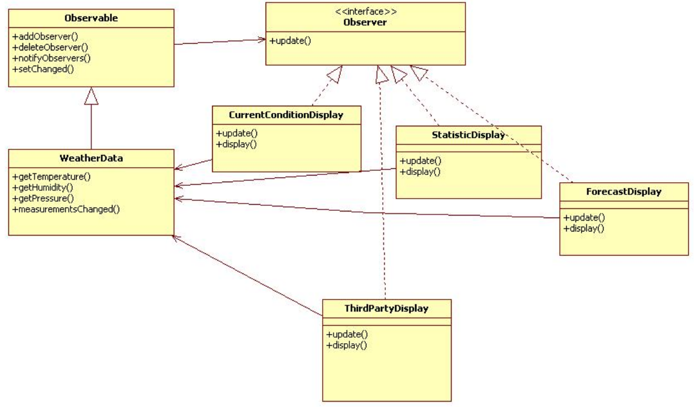

# 옵저버 패턴이란?

한 객체의 상태가 바뀌면, 그 객체에 의존하는 다른 객체들에게 자동으로 연락이 갱신되는 일대다 의존성 패턴이다.

**주제 객체**가 존재하고, 이 객체가 **여러 상태(**변수?)를 갖고 있다. 옵저버는 자신이 주시하고 있는 주제 객체에 있는 변수의 상태가 변경될 시 그 내용을 자신에게 적용한다.

옵저버 패턴이라고 말할 수 있으려면, 아래와 같은 조건을 만족시켜야 한다.

- 주제 객체와 옵저버 간 **느슨한 결합**
- 옵저버를 추가할 때 주제 객체에 영향이 없어야 한다.
- 주제 혹은 옵저버의 내용이 변경되더라도 서로에게 영향이 없어야 한다.

  

# 옵저버 패턴 예제

WeatherData가 주제 객체이고, CurrentConditionDisplay, StatisticDisplay, ForecastDisplay 가 WeatherData를 주시하는 옵저버들이다.

WeatherData는 Subject 인터페이스를 구현하므로, 옵저버를 등록, 삭제하거나 옵저버에게 알림을 줄 수 있다. 여기서 **notifyObserver()** 메서드가 등록된 옵저버들이 상태 변화를 감지할 수 있게하는 역할을 한다.

 

옵저버 중 하나인 CurrentConditionsDisplay 클래스의 코드

정리하면, 옵저버 패턴은 주제 객체의 상태 변화를 다른 클래스들이 즉각 감지할 필요가 있는 경우 사용된다. 주제 객체에 옵저버들을 관리하는 자료구조를 두고, 상태에 변화가 생기면 주제 객체에 등록된 옵저버들의 update(params) 메서드를 호출함으로써 변화한 상태를 전달해준다.

조금 더 나아가면, 상태가 변하는 정도에 따라 옵저버에게 신호를 줄지 말지 결정할 수 있도록 구현할 수도 있고, 특정 상태 변화 시 특정 옵저버에게만 신호를 주도록 구현할 수도 있다.
  

# Observable class, Observer interface

자바에는 내장된 모듈을 사용해서 옵저버 패턴을 코드에 적용할 수 있다. 자바에 내장된 옵저버 패턴의 대략적인 구조는 아래와 같다. (Observable 참고문서 : [https://docs.oracle.com/javase/7/docs/api/java/util/Observable.html](https://docs.oracle.com/javase/7/docs/api/java/util/Observable.html))

Observable과 Observer의 멤버는 이전 예시와 크게 다르지 않지만, Observable 클래스에 setChanged() 메서드가 추가로 존재한다. 이 메서드는 Observable 클래스를 상속받은 주제 객체 (위 그림에서 WeatherData 클래스) 의 상태가 변했음을 마킹하는 메서드이다. WeatherData의 상태가 변화했을 경우 measurementChanged() 가 호출되는데, 이 메서드 안에서 setChanged() → notifyObserver(Observer o) 와 같은 순서로 호출이 이루어진다. 만약 setChanged() 가 호출되지 않은 채로 notifyObserver() 메서드가 호출된다면 옵저버에게 알림이 가지 않을 것이다.

한 가지 알아두어야 할 것은 **Observable은 인터페이스가 아닌 클래스이다. 즉, 주제 객체가 다른 클래스를 상속해야할 경우 자바 내장 옵저버 패턴은 사용할 수 없다.**
  

# push, pull

옵저버 패턴에서 주제 객체가 옵저버에게 신호를 주는 방식은 두 가지가 있다. 

- push

    상태 변화 시 주제 객체가 어떠한 옵저버에게 알림을 줄지 판단하여 전달하는 방식

- pull

    상태 변화 시 주제 객체는 상태가 변화했음을 마킹하고, 각 옵저버들이 주제 객체의 상태를 확인하여 각자 주시하는 상태의 변화를 체크한다.

알림을 주어야 하는 횟수가 잦을수록, 각 옵저버마다 주시하는 상태가 다르고 그 변동폭이 제각각일수록 push 방식보다는 pull 방식을 사용하는 것이 효율적이다.