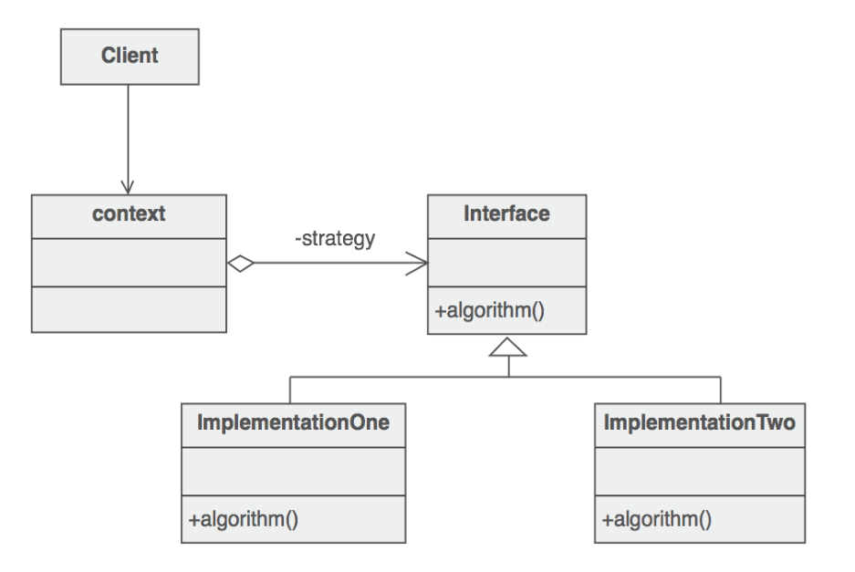
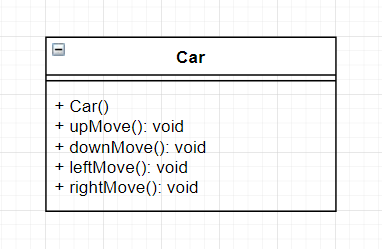
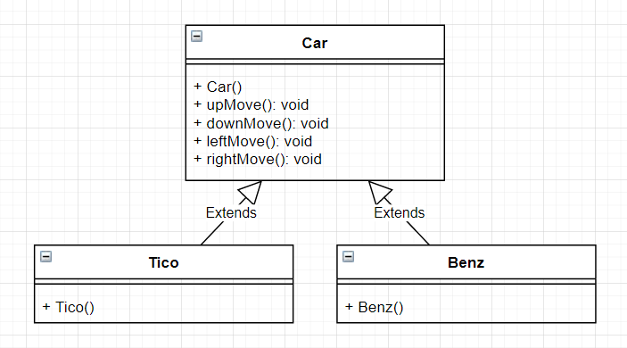
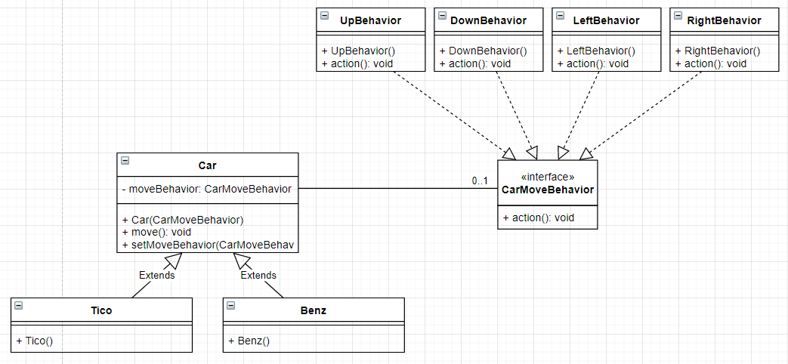
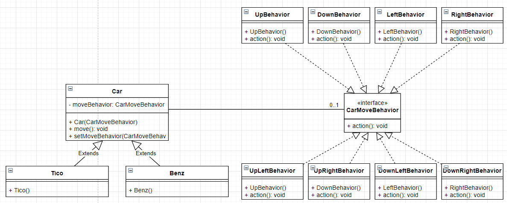

# 전략 패턴이란?

클래스의 행동 (메서드) 을 인터페이스에 위임하고, 그 인터페이스 변수를 설정할 수 있는 setter를 통해 각 클래스 간 의존성을 없애는 패턴.

상속과 다형성의 좋은 활용 예시로 볼 수 있다.

출처 : [https://niceman.tistory.com/133](https://niceman.tistory.com/133)

context 클래스가 어떠한 알고리즘을 수행하는 클래스들의 조상 클래스라고 할 때, context 클래스에 인터페이스 변수를 두어 이 인터페이스의 algorithm() 메서드를 활용하는 패턴이 전략 패턴이다.

이 때 context 클래스가 implement하는 인터페이스를 상속해서 여러 인터페이스를 만들 수 있다. (위 그림에서 ImplementationOne, ImplementationTwo) 이렇게 만들어진 인터페이스들이 각각의 전략들이다.
  

# 전략 패턴 예시

전략 패턴 없이 상, 하, 좌, 우로 움직일 수 있는 자동차를 구현해보자. 가장 간단히 생각할 수 있는 설계는 아래와 같다. 

이 자동차 클래스를 이용해 티코와 벤츠 자동차를 간단히 설계할 수 있다.

그런데, 여기서 벤츠 자동차는 대각선 움직임이 가능해야한다면 어떻게 설계를 해야할까? 벤츠 클래스에 upRightMove(), upLeftMove(), downRightMove(), downLeftMove() 메서드를 추가해주어야 할 것이다. 여기서 그치지 않고 BMW 자동차 클래스를 만드는데, 이 자동차에도 대각선 움직임이 가능해야 한다면? 대각선 움직임이 불가능한 자동차 때문에 대각선 움직임이 가능한 여러 자동차 클래스들에 각각 메서드를 추가해주어야 한다. 이러한 설계는 코드의 재사용성, 확장성을 떨어뜨리고, 유지보수의 어려움을 야기한다.

전략 패턴을 사용하여 이러한 불편함을 해소시킬 수 있다.

이 설계대로 구현했을 때 티코 객체를 오른쪽으로 움직이고 싶다면, `tico.setMoveBehavior(new RightBehavior())` 을 통해 방향을 바꿔주고, `tico.move()` 를 호출하여 자동차를 오른쪽으로 움직일 수 있다.

이렇게 전략 패턴을 사용하면, 대각선 움직임을 추가하는건 어떻게 설계할 수 있을까?

이렇게 전략들만 추가하고, `benz.setMoveBehavior(new UpRightBehavior()); benz.move();` 를 통해 벤츠 자동차를 북동쪽으로 움직일 수 있다.
  

# 전략 패턴, 장점이 뭐야?

 전략 패턴의 가장 큰 장점은 어떠한 행동의 변경이나 추가, 삭제가 필요할 때, 해당 행동을 사용하는 클래스 코드에 변경 없이 작업이 가능하다는 점이다.

특히 위 예시와 같이 어떠한 클래스들의 조상 클래스의 변경은 프로그램 구현에 아주 치명적일 수 있다. 의도치 않은 상속이 이루어질 수 있기 때문이다. 전략 패턴을 사용하면 기능 추가를 위해 인터페이스를 상속한 전략들을 만들어주면 되고, 삭제하고 싶다면 해당 전략을 없애기만 하면 된다.
  

# 전략 패턴이 사용되는 실제 예시

테스트 코드에서 자주 사용되는 Mock 객체