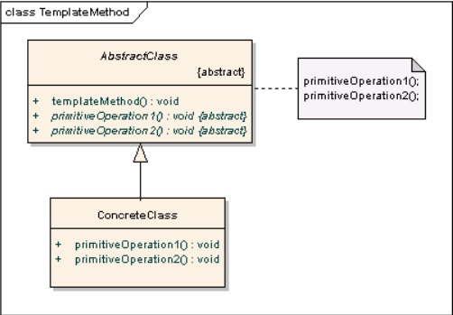

# 템플릿 메서드 패턴이란?

행위(Behavior) 패턴의 종류 중 하나

(행위 패턴 : 객체 혹은 클래스 간 책임, 알고리즘 분배 문제에 관련된 패턴)

상위 클래스(추상)에서 알고리즘 단계들의 흐름을 정의하고, 하위 클래스(구상)에서 필요 시 각 단계를 재정의할 수 있도록 하는 패턴이다.

상위 패턴에서 정의한 알고리즘 흐름은 변하지 않는다. 하위 클래스에서는 각 단계를 재정의할 수 있을 뿐이다.

**"변하지 않는 기능은 상위 클래스에서, 자주 변경되거나 확장할 기능은 하위 클래스에서 정의한다."**
  

# 템플릿 메서드 예시

 AbstractClass에서 추상 메서드로 선언된 primitiveOperation1()과 primitiveOperation2()는 이를 상속하는 하위 클래스마다 따로 구현해야 한다.

AbstractClass의 templateMethod()가 템플릿 메서드이며, 이 메서드는 메서드의 호출 순서를 정해둠으로써 하위 클래스들이 일관된 알고리즘을 사용하도록 강제한다.

물론 templateMethod()를 하위 클래스에서 오버라이딩할 수 없어야 일관된 알고리즘 순서가 유지되므로 **final 키워드를 붙여주는 것이 일반적이다.**

각 알고리즘 단계 중 **hook**라고 불리는 것들이 있다. 보통의 각 단계들은 추상 메서드이므로 하위 클래스마다 구현을 해주어야 하는데, AbstractClass에서 기본적인 내용만 구현해 두거나 비어있는 일반 메서드로 작성해두어서 하위 클래스에서 필요한 경우에만 따로 오버라이딩할 수 있도록 해둔 메서드들을 hook라고 부른다.
  

## 예시 참고

[https://www.crocus.co.kr/1531](https://www.crocus.co.kr/1531) (커피 예시가 적절함. AbstractClass의 hook와 추상 메서드 간 차이를 이해하기 좋다.)
  

# 템플릿 메서드 패턴의 장단점

## 장점

- **일관된 알고리즘을 유지**하면서, 각 단계의 세부 내용을 바꿔줄 수 있다.
- 알고리즘이 오직 상위 클래스에서만 정의되므로, **알고리즘 수정이 필요할 시 수정이 간단하다.**
- **서브 클래스에서 세부 내용 변환**이 이루어지므로, 코드가 재사용된다.
- 해당 알고리즘을 사용해야 할 새로운 상황이 생긴 경우, 간단하게 서브 클래스를 만들어서 추상 메서드 및 hook를 구현해주면 된다.
- 정리하면, **코드를 조금 더 객체지향적으로 구성**할 수 있다. (상속, 다형성 적극 이용)

## 단점

- 상속을 이용해 템플릿 메서드 패턴을 구현했다면, 서브클래스는 다른 클래스를 상속할 수 없다.

    (다중상속 지원 안하는 언어일 시)

- 추상 메서드가 증가할수록 서브 클래스 관리가 복잡해진다.